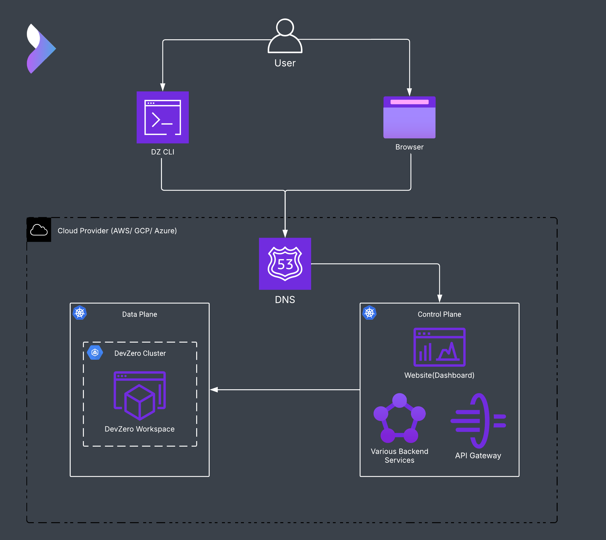

[](https://creativecommons.org/licenses/by-nc/4.0/)


# DevZero Self-Hosted

Welcome to the **self-hosted** repository. This repository contains all the necessary components for setting up and managing a self-hosted environment, including infrastructure as code, deployment configurations, and custom tooling.



## Flow of the Architecture

1. **User Interaction**
   - Users interact with the DevZero environment through two interfaces:
     - **DZ CLI**: A command-line interface for managing DevZero resources.
     - **Browser**: A web-based interface to access the DevZero dashboard and workspaces.

2. **DNS Resolution**
   - Both the DZ CLI and Browser requests are routed through the **DNS** (Domain Name System).
   - The DNS resolves the requests to the appropriate endpoints within the cloud infrastructure.

3. **Cloud Provider Infrastructure**
   - The environment is hosted on a cloud provider such as **AWS**, **GCP**, or **Azure**.
   - The cloud provider manages the underlying infrastructure, including networking and resource allocation.

4. **Control Plane**
   - After DNS resolution, user requests are routed to the **Control Plane**, which operates on a Kubernetes cluster within the cloud provider.
   - The Control Plane consists of:
     - **Website (Dashboard):** A user-friendly web interface for managing DevZero projects, monitoring activities, and configuring resources.
     - **API Gateway:** Facilitates secure and efficient communication between the front-end (Dashboard/DZ CLI) and backend services.
     - **Various Backend Services:** Handle core business logic, authentication, data processing, and manage communication with the Data Plane.


5. **Data Plane**
   - The Control Plane communicates with the **Data Plane**, which includes:
     - **DevZero Cluster**: A Kubernetes cluster.
     - **DevZero Workspace**: A microVM-based environment built from a recipe.

## Repository Structure

```bash
self-hosted/
├── kata/
├── terraform/
├── charts/
├── dz_installer/
└── README.md
```

### **kata/**
- Used to create Amazon Machine Images (AMIs) required in the infrastructure for setting up Kubernetes nodes with Kata as the default `RuntimeClass`.
- Build and manage AMIs optimised for secure and efficient Kubernetes workloads using Kata Containers.
- Check out [kata/README.md](./kata/README.md) to know more.
- Kata AMI build workflow: https://github.com/devzero-inc/self-hosted/actions/workflows/build-kata-ami.yaml

### **terraform/**
- Contains Infrastructure as Code (IaC) scripts to provision the required infrastructure on cloud platforms such as AWS, GCP, and Azure for self-hosting the DevZero Control Plane and Data Plane.
- Deploy and manage scalable infrastructure tailored for DevZero’s self-hosted architecture.
- Check out [terraform/README.md](./terraform/README.md) to learn more.
- Deployment and testing pipeline: https://github.com/devzero-inc/self-hosted/actions/workflows/dsh-testing.yaml

### **charts/**
- Contains Helm charts used to package, configure, and deploy the DevZero Control Plane and Data Plane.
- Utilise Helm to streamline Kubernetes application deployments, ensuring consistent and repeatable configurations.
- Check out [charts/README.md](./charts/README.md) to know more.
- **[View Running Pipeline](https://github.com/devzero-inc/self-hosted/actions/runs/13118086483/job/36597219883)**

### **dz_installer/**
- A Python CLI tool designed for easy requirement checks, installation, and validation of DevZero self-hosted environments based on user-specific requirements.
- Simplify the setup process by automating environment validation and installation workflows through interactive user inputs.
- Check out [dz_installer/README.md](./dz_installer/README.md) to learn more.

## How They Fit Together

- **kata** builds the custom AMIs required for Kubernetes nodes, optimised with Kata Containers as the default runtime.
- **terraform** provisions the infrastructure across different cloud providers to support both the Control Plane and Data Plane of DevZero.
- **charts** deploys the DevZero Control Plane and Data Plane onto the infrastructure provisioned by Terraform.
- **dz_installer** ensures seamless installation and validation of the self-hosted setup, guiding users through configuration and deployment steps.

## Getting Started

1. **Build AMIs:**
   - Use the `kata/` directory to create the AMIs required for Kubernetes nodes. If you prefer to skip building custom Kata AMIs, you can proceed directly to provisioning infrastructure. The Terraform scripts are configured to use the public Kata AMIs created by DevZero.

2. **Provision Infrastructure:**
   - Navigate to the `terraform/` folder and follow the instructions to deploy the necessary cloud infrastructure. 

3. **Deploy Applications:**
   - Deploy the DevZero Control Plane and Data Plane using Helm charts from the `charts/` directory.

4. **Automate Setup:**
   - Leverage the `dz_installer/` Python CLI to check prerequisites, install components, and validate the environment.

For detailed instructions, refer to the specific README files within each folder.

## How to Contribute

We welcome contributions! Please review our [CONTRIBUTING.md](.github/CONTRIBUTING.md) for guidelines on how to get started.

## Code of conduct

This project has a [Code of Conduct](.github/CODE_OF_CONDUCT.md).

## License

The contents of this repository are licensed under `CC BY-NC 4.0`. For more information, see [LICENSE](LICENSE).
